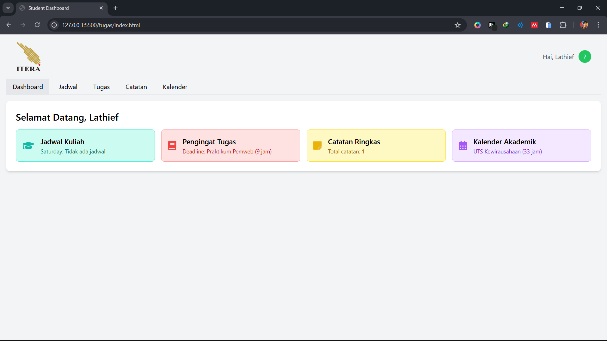
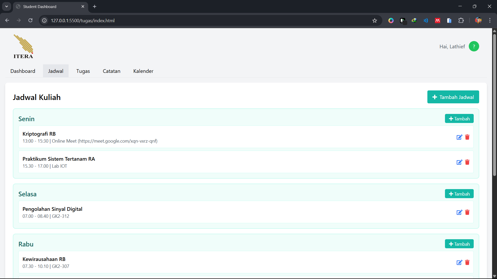
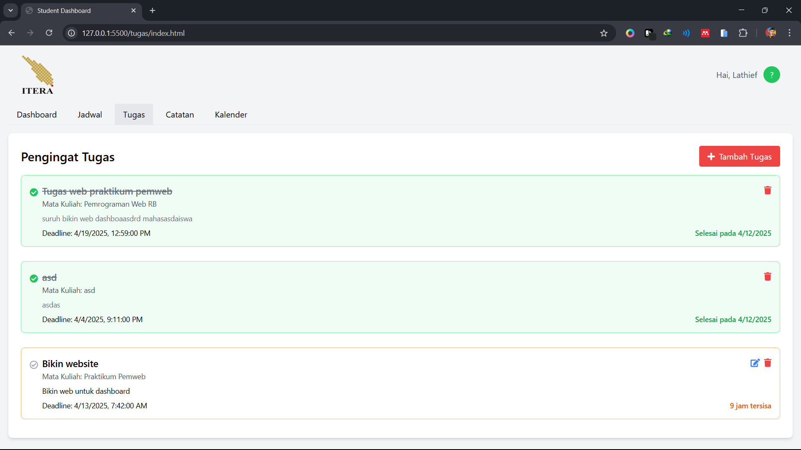
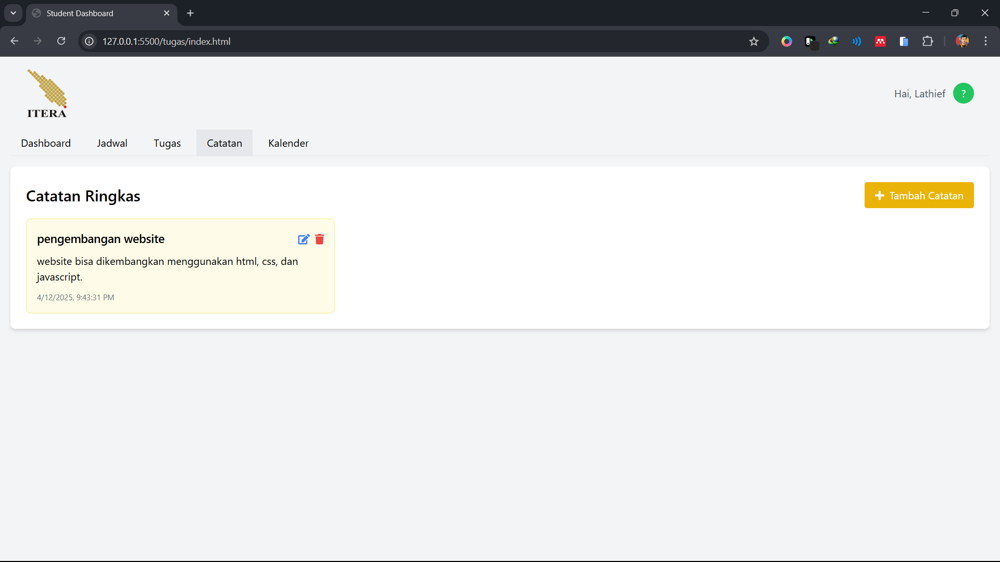
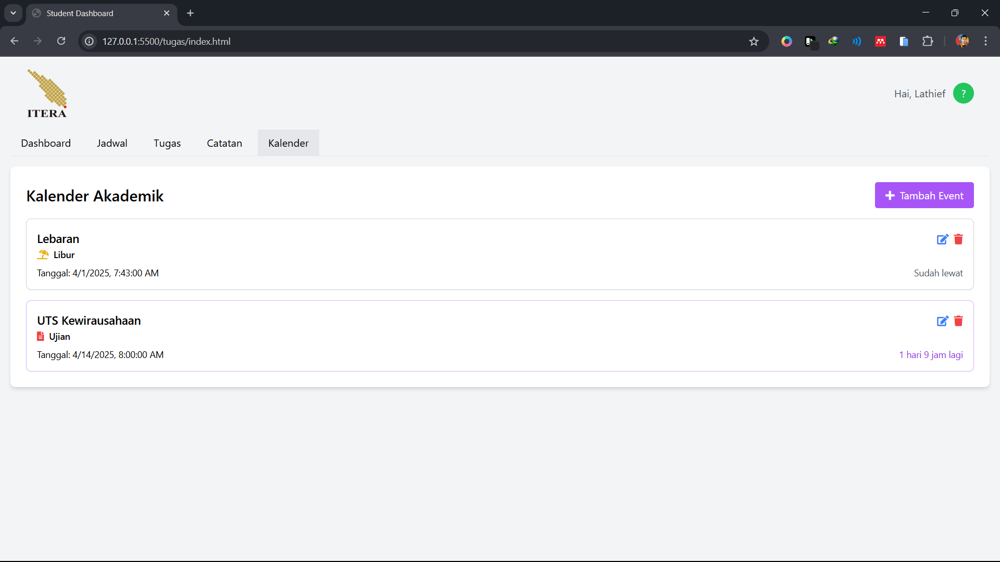

# ITERA Student Dashboard


## 📝 Deskripsi

Student Dashboard adalah aplikasi web yang membantu mahasiswa mengelola kegiatan akademik mereka secara efisien. Aplikasi ini dirancang untuk mempermudah mahasiswa dalam mengorganisir jadwal kuliah, mengingat tugas, menyimpan catatan, dan mengelola kalender akademik.

## ✨ Fitur Utama

- **Profil Pengguna**: Simpan dan edit informasi pengguna (nama, NIM, program studi)
- **Dashboard**: Tampilan ringkas untuk melihat semua informasi penting sekaligus
- **Jadwal Kuliah**: Kelola jadwal perkuliahan berdasarkan hari
- **Pengingat Tugas**: Buat daftar tugas dengan deadline dan status penyelesaian
- **Catatan Ringkas**: Simpan catatan penting untuk referensi cepat
- **Kalender Akademik**: Lacak ujian, tenggat waktu, dan acara penting lainnya

## 📸 Screenshots

### Dashboard Utama


### Jadwal Kuliah


### Pengingat Tugas


### Catatan


### Kalender


## 🔍 Implementasi Fitur ES6+

### 1. Penggunaan let dan const
```javascript
// const untuk nilai tetap
const taskManager = new TaskManager();
const eventsList = document.getElementById("eventsList");

// let untuk nilai yang berubah
let statusClass = isCompleted ? "border-green-300" : isOverdue ? "border-red-300" : "border-orange-300";
let timeLeftDisplay = "";
```

### 2. Arrow Function
```javascript
// Implementasi dalam event handlers
document.getElementById("saveTaskBtn").addEventListener("click", async function() {
  // ...handler code
});

// Implementasi dalam array operations
const completedCount = tasks.filter(t => t.completed).length;

// Implementasi dalam setTimeout
setTimeout(() => {
  notification.classList.remove("opacity-0");
  notification.classList.add("opacity-100");
}, 10);
```

### 3. Template Literals
```javascript
taskCard.innerHTML = `
  <div class="flex justify-between">
    <h2 class="text-lg font-semibold">${task.title}</h2>
    <div class="flex space-x-2">
      <button class="text-blue-500 hover:text-blue-700" onclick="editTask(${index})">
        <i class="fas fa-edit"></i>
      </button>
      <button class="text-red-500 hover:text-red-700" onclick="deleteTask(${index})">
        <i class="fas fa-trash"></i>
      </button>
    </div>
  </div>
  <p class="text-sm text-gray-600 mb-2">Mata Kuliah: ${task.course}</p>
`;
```

### 4. Classes dan OOP
```javascript
class Task {
  constructor(title, course, deadline, description, completed = false, completedDate = null) {
    this.title = title;
    this.course = course;
    this.deadline = deadline;
    this.description = description;
    this.completed = completed;
    this.completedDate = completedDate;
  }

  complete() {
    this.completed = true;
    this.completedDate = new Date().toISOString();
    return this;
  }

  shouldAutoDelete() {
    if (!this.completed || !this.completedDate) return false;
    
    const completedTime = new Date(this.completedDate).getTime();
    const currentTime = new Date().getTime();
    const oneDayInMs = 24 * 60 * 60 * 1000;
    
    return (currentTime - completedTime) > oneDayInMs;
  }

  static fromObject(obj) {
    return new Task(obj.title, obj.course, obj.deadline, obj.description, 
                   obj.completed || false, obj.completedDate || null);
  }
}
```

### 5. Async/Await dan Promises
```javascript
export async function renderTasksList() {
  const tasksList = document.getElementById("tasksList");
  tasksList.innerHTML = '<p class="text-center"><i class="fas fa-spinner fa-spin"></i> Loading tasks...</p>';
  
  try {
    const tasks = await taskManager.getTasks();
    
    tasksList.innerHTML = "";
    // More rendering code...
  } catch (error) {
    console.error("Error rendering tasks:", error);
    tasksList.innerHTML = '<p class="text-red-500 text-center py-4">Error loading tasks. Please try again.</p>';
  }
}

async getTasks() {
  return new Promise(resolve => {
    const tasksData = Storage.getTasks();
    const tasks = tasksData.map(task => Task.fromObject(task));
    setTimeout(() => resolve(tasks), 100); // Simulate async delay
  });
}
```

## 🔧 Fitur Khusus
- Auto-Cleanup: Tugas yang ditandai selesai otomatis dihapus setelah 24 jam
- Visualisasi Status: Tugas memiliki warna berbeda berdasarkan status (selesai, terlambat, mendekati deadline)
- UI Animations: Transisi halus untuk modal dan interaksi pengguna
- Responsive Design: Tampilan yang menyesuaikan berbagai ukuran layar
- 
## 🚀 Cara Penggunaan
1. Masukkan informasi pengguna saat pertama kali membuka aplikasi
2. Navigasi antara tab menggunakan menu di bagian atas
3. Tambah, edit, atau hapus item menggunakan tombol yang tersedia
4. Klik item di dashboard untuk langsung navigasi ke tab terkait

## 💻 Teknologi yang Digunakan
- HTML5
- CSS3 dengan Tailwind CSS
- JavaScript ES6+
- LocalStorage untuk menyimpan data
